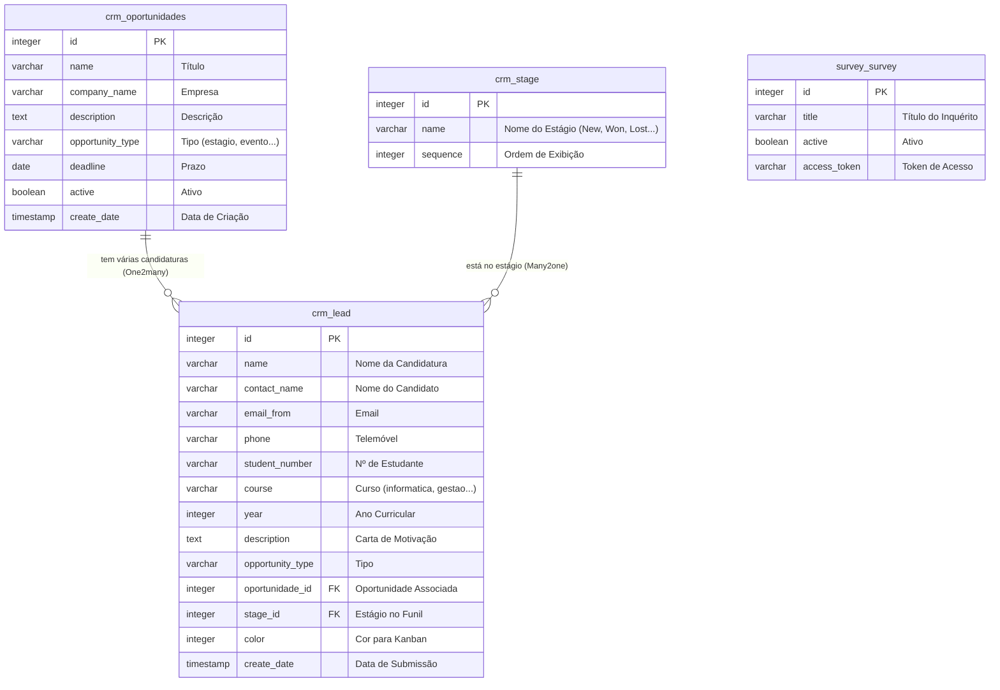

# Documentação da Base de Dados - CRM Estudantil UEM

Esta documentação descreve a estrutura da base de dados do projeto **CRM Estudantil**, detalhando como as classes do Odoo ORM são mapeadas para as tabelas do PostgreSQL, as relações entre entidades, e as formas de inserir dados fictícios (mock data) para testes.

---

## 1. Arquitetura da Base de Dados & Odoo ORM

O Odoo utiliza um mapeador objeto-relacional (ORM) integrado. Cada modelo Python herdado de `models.Model` é mapeado automaticamente para uma tabela correspondente no PostgreSQL:
* O nome da tabela no PostgreSQL substitui os pontos (`.`) do `_name` do Odoo por underscores (`_`).
* **Exemplos:**
  * O modelo herdado `crm.lead` é guardado na tabela `crm_lead`.
  * O modelo customizado `crm.oportunidades` é guardado na tabela `crm_oportunidades`.
  * O modelo padrão `crm.stage` (estágios de funil) é guardado na tabela `crm_stage`.

---

## 2. Diagrama de Relações (ER)

O diagrama abaixo ilustra como as tabelas principais do CRM Estudantil se relacionam entre si:



---

## 3. Especificação das Tabelas e Campos

### 3.1. Tabela: `crm_oportunidades` (Modelo Odoo: `crm.oportunidades`)
Guarda as vagas e oportunidades publicadas pela administração para os estudantes.

| Nome no Odoo | Tipo no Odoo | Tipo no PostgreSQL | Restrições / Detalhes | Descrição |
| :--- | :--- | :--- | :--- | :--- |
| `id` | `Integer` | `INT4` | `PRIMARY KEY` (Auto-incremento) | Identificador único da vaga |
| `name` | `Char` | `VARCHAR` | `required=True` | Título da vaga/oportunidade |
| `company_name`| `Char` | `VARCHAR` | - | Nome da empresa ou instituição parceira (padrão: "UEM") |
| `description` | `Text` | `TEXT` | - | Descrição detalhada dos requisitos e benefícios |
| `opportunity_type` | `Selection` | `VARCHAR` | `required=True`, padrão: `'estagio'` | Categoria da vaga: `estagio`, `posgraduacao`, `evento`, `suporte` |
| `deadline` | `Date` | `DATE` | - | Data limite de candidatura |
| `active` | `Boolean` | `BOOL` | padrão: `True` | Indica se a vaga está visível no portal |
| `create_date` | `Datetime` | `TIMESTAMP` | Automático | Data de publicação/criação no sistema |

---

### 3.2. Tabela: `crm_lead` (Modelo Odoo: `crm.lead`)
Tabela nativa do Odoo estendida com os campos específicos para a Gestão Acadêmica de Candidaturas Estudantis.

| Nome no Odoo | Tipo no Odoo | Tipo no PostgreSQL | Restrições / Detalhes | Descrição |
| :--- | :--- | :--- | :--- | :--- |
| `id` | `Integer` | `INT4` | `PRIMARY KEY` (Auto-incremento) | Identificador único |
| `name` | `Char` | `VARCHAR` | Automático | Título interno (gerado como `"Candidatura: [Nome]"`) |
| `contact_name`| `Char` | `VARCHAR` | - | Nome completo do estudante |
| `email_from` | `Char` | `VARCHAR` | - | Endereço de email de contato |
| `phone` | `Char` | `VARCHAR` | - | Número de telefone/telemóvel |
| `student_number`| `Char` | `VARCHAR` | `index=True` (pesquisa rápida) | Número de matrícula do estudante na UEM |
| `course` | `Selection` | `VARCHAR` | - | Curso: `informatica`, `gestao`, `direito`, `medicina`, `economia`, `outro` |
| `year` | `Integer` | `INT4` | - | Ano curricular do estudante (ex: 1º ao 5º ano) |
| `description` | `Text` | `TEXT` | - | Carta de motivação inserida no formulário |
| `opportunity_type` | `Selection` | `VARCHAR` | `required=True`, `index=True` | Tipo correspondente ao selecionado pelo estudante |
| `oportunidade_id` | `Many2one` | `INT4` | `FOREIGN KEY` -> `crm_oportunidades(id)`, `ondelete='set null'` | Referência direta para a vaga que motivou a candidatura |
| `stage_id` | `Many2one` | `INT4` | `FOREIGN KEY` -> `crm_stage(id)` | Identifica o estágio do funil (Novo, Em Análise, Aprovado, Rejeitado) |
| `color` | `Integer` | `INT4` | Calculado dinamicamente (`store=True`) | Código numérico Odoo (0-11) para pintar o cartão no Kanban |
| `create_date` | `Datetime` | `TIMESTAMP` | Automático | Data e hora em que a candidatura foi submetida |

---

## 4. Como Popular a Base de Dados com Dados Fictícios (Mock Data)

Há duas formas práticas de injetar dados fictícios no projeto: via **Odoo Shell** (ideal para desenvolvimento rápido) ou via arquivos **XML Data** (inserção nativa definitiva).

### Método A: Usando o Odoo Shell (Mais Rápido em Desenvolvimento)
Pode executar um script diretamente no ambiente interativo do Odoo que roda debaixo do Docker.

1. **Aceda ao container do Odoo em modo interativo (Shell):**
   ```bash
   docker-compose exec web odoo shell -c /etc/odoo/odoo.conf -d postgres
   ```
2. **Execute o seguinte script Python dentro do prompt interativo:**
   ```python
   # 1. Obter ou criar um estágio para testar as candidaturas
   stage_new = env['crm.stage'].search([('name', '=', 'New')], limit=1)
   stage_qual = env['crm.stage'].search([('name', '=', 'Qualified')], limit=1)
   stage_won = env['crm.stage'].search([('name', '=', 'Won')], limit=1)

   # 2. Criar Oportunidades Mock
   op1 = env['crm.oportunidades'].create({
       'name': 'Estágio de Verão em Web Dev',
       'company_name': 'Vodacom Moçambique',
       'description': 'Estágio voltado para desenvolvimento web com Django e PostgreSQL.',
       'opportunity_type': 'estagio',
       'deadline': '2026-08-30',
   })

   op2 = env['crm.oportunidades'].create({
       'name': 'Bolsa de Mestrado em IA',
       'company_name': 'Universidade Eduardo Mondlane',
       'description': 'Pesquisa avançada em redes neuronais e processamento de linguagem natural.',
       'opportunity_type': 'posgraduacao',
       'deadline': '2026-07-15',
   })

   op3 = env['crm.oportunidades'].create({
       'name': 'Hackathon Universitário 2026',
       'company_name': 'UEM Fac. Engenharia',
       'description': 'Maratona de programação para solucionar desafios urbanos.',
       'opportunity_type': 'evento',
       'deadline': '2026-06-25',
   })

   # 3. Criar Candidaturas Mock ligadas às Oportunidades
   env['crm.lead'].create({
       'name': 'Candidatura: Ana Maria Matsinhe',
       'contact_name': 'Ana Maria Matsinhe',
       'email_from': 'ana.matsinhe@uem.ac.mz',
       'phone': '+258 84 123 4567',
       'student_number': '20230541',
       'course': 'informatica',
       'year': 3,
       'opportunity_type': 'estagio',
       'description': 'Candidatei-me porque programo em Python há 2 anos e quero obter experiência profissional real.',
       'oportunidade_id': op1.id,
       'stage_id': stage_new.id if stage_new else False,
   })

   env['crm.lead'].create({
       'name': 'Candidatura: Carlos Mucavel',
       'contact_name': 'Carlos Mucavel',
       'email_from': 'carlos.mucavel@uem.ac.mz',
       'phone': '+258 82 987 6543',
       'student_number': '20210874',
       'course': 'economia',
       'year': 5,
       'opportunity_type': 'posgraduacao',
       'description': 'Desejo aprofundar meus conhecimentos sobre aplicação de IA para previsão de mercados emergentes.',
       'oportunidade_id': op2.id,
       'stage_id': stage_qual.id if stage_qual else False,
   })

   # 4. Gravar permanentemente as alterações na BD postgres
   env.cr.commit()
   print(">>> Dados mockados adicionados com sucesso!")
   ```

---

### Método B: Utilizando Ficheiro XML do Odoo (`data/mock_data.xml`)
Pode criar um ficheiro em `custom_addons/crm_estudantil/data/mock_data.xml` para que os dados sejam criados de forma automática no momento de instalação ou atualização do módulo.

```xml
<?xml version="1.0" encoding="utf-8"?>
<odoo>
    <data noupdate="1"> <!-- noupdate="1" evita que os dados sejam resetados a cada upgrade -->
        
        <!-- Oportunidade 1 -->
        <record id="mock_oportunidade_estagio" model="crm.oportunidades">
            <field name="name">Estágio de Backend Engineer</field>
            <field name="company_name">Absa Bank</field>
            <field name="description">Vaga para trabalhar com sustentação e APIs em Python.</field>
            <field name="opportunity_type">estagio</field>
            <field name="deadline">2026-09-30</field>
            <field name="active">True</field>
        </record>

        <!-- Candidatura correspondente -->
        <record id="mock_candidatura_estudante_1" model="crm.lead">
            <field name="name">Candidatura: Mateus Langa</field>
            <field name="contact_name">Mateus Langa</field>
            <field name="email_from">mateus.langa@uem.ac.mz</field>
            <field name="student_number">20240989</field>
            <field name="course">informatica</field>
            <field name="year">2</field>
            <field name="opportunity_type">estagio</field>
            <field name="description">Estou motivado a aprender arquiteturas orientadas a eventos.</field>
            <field name="oportunidade_id" ref="mock_oportunidade_estagio"/>
            <field name="type">lead</field>
        </record>

    </data>
</odoo>
```
*Lembre-se de adicionar `'data/mock_data.xml',` à lista `'data'` em `__manifest__.py` caso crie este ficheiro.*

---

## 5. Consultar Tabelas Diretamente no PostgreSQL

Caso queira aceder ao cliente de base de dados interativo (psql) para inspecionar os dados reais das tabelas, utilize os comandos abaixo no seu terminal:

1. **Aceda à consola PostgreSQL do container de BD:**
   ```bash
   docker-compose exec db psql -U odoo -d postgres
   ```
2. **Comandos PSQL Úteis:**
   * Lista de tabelas: `\dt`
   * Detalhes das colunas de oportunidades: `\d crm_oportunidades`
   * Detalhes das colunas de candidaturas: `\d crm_lead`
3. **Exemplos de Consultas SQL (dentro do PSQL):**
   ```sql
   -- Ver todas as oportunidades ativas
   SELECT id, name, company_name, deadline FROM crm_oportunidades WHERE active = TRUE;

   -- Ver os candidatos com seus respectivos cursos e as vagas correspondentes
   SELECT l.contact_name, l.student_number, l.course, o.name AS vaga 
   FROM crm_lead l
   LEFT JOIN crm_oportunidades o ON l.oportunidade_id = o.id
   WHERE l.student_number IS NOT NULL;
   ```
